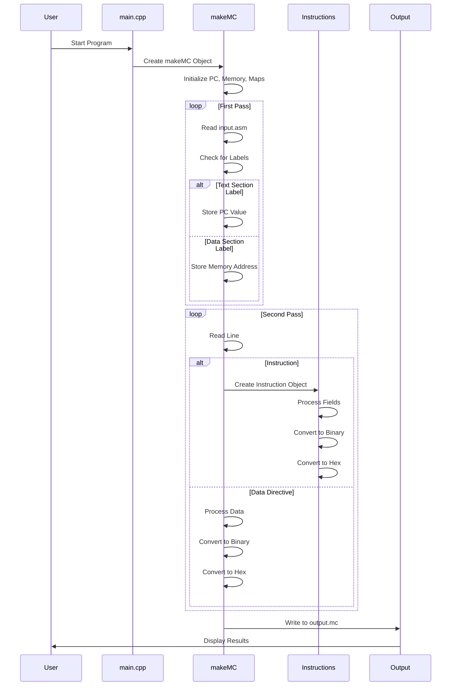

```mermaid
graph TD
    %% Main Components
    A[input.asm] --> B[makeMC Class]
    B --> C[output.mc]
    
    %% Initialization
    B --> D[Initialization]
    D --> D1[PC = 0]
    D --> D2[Memory Counter]
    D --> D3[Label Map]
    D --> D4[Memory Map]
    
    %% First Pass
    B --> E[First Pass - Label Collection]
    E --> E1[Read input.asm]
    E1 --> E2[Check for Labels]
    E2 --> E3[Text Section Labels]
    E2 --> E4[Data Section Labels]
    E3 --> E5[Store PC Values]
    E4 --> E6[Store Memory Addresses]
    
    %% Second Pass
    B --> F[Second Pass - Processing]
    F --> F1[Read Lines]
    F1 --> F2[Check Directives]
    F2 --> F3[.text Section]
    F2 --> F4[.data Section]
    F2 --> F5[Data Directives]
    
    %% Instruction Processing
    F1 --> F6[Process Instructions]
    F6 --> F7[Identify Type]
    F7 --> F8[R-type]
    F7 --> F9[I-type]
    F7 --> F10[S-type]
    F7 --> F11[U-type]
    F7 --> F12[UJ-type]
    F7 --> F13[SB-type]
    
    %% Data Processing
    F5 --> F14[Process Data]
    F14 --> F15[.byte]
    F14 --> F16[.half]
    F14 --> F17[.word]
    F14 --> F18[.dword]
    F14 --> F19[.asciz]
    
    %% Error Handling
    F6 --> F20[Error Handling]
    F20 --> F21[Register Validation]
    F20 --> F22[Immediate Value Check]
    F20 --> F23[Format Validation]
    
    %% Output Generation
    F6 --> G[Output Generation]
    G --> G1[Write PC]
    G --> G2[Write Instruction]
    G --> G3[Write Original Code]
    G --> G4[Write Details]
    
    %% Final Steps
    G --> H[Final Steps]
    H --> H1[Close Files]
    H --> H2[Add Null Instruction]
    H --> H3[Terminate Program]
    
    %% Class Hierarchy
    subgraph Class_Hierarchy
        I[instructions Base Class]
        I --> J[R-type]
        I --> K[I-type]
        I --> L[S-type]
        I --> M[U-type]
        I --> N[UJ-type]
        I --> O[SB-type]
    end
    
    %% Style Definitions
    classDef process fill:#f9f,stroke:#333,stroke-width:2px;
    classDef data fill:#bbf,stroke:#333,stroke-width:2px;
    classDef class fill:#bfb,stroke:#333,stroke-width:2px;
    
    class A,C data;
    class B,D,E,F,G,H process;
    class I,J,K,L,M,N,O class;
```

```mermaid
stateDiagram-v2
    [*] --> Initialization
    Initialization --> LabelCollection
    LabelCollection --> InstructionProcessing
    InstructionProcessing --> DataProcessing
    DataProcessing --> OutputGeneration
    OutputGeneration --> [*]
    
    state LabelCollection {
        [*] --> ReadFile
        ReadFile --> CheckLabels
        CheckLabels --> StoreLabels
        StoreLabels --> [*]
    }
    
    state InstructionProcessing {
        [*] --> IdentifyType
        IdentifyType --> ProcessFields
        ProcessFields --> ConvertBinary
        ConvertBinary --> ConvertHex
        ConvertHex --> [*]
    }
    
    state DataProcessing {
        [*] --> CheckDirective
        CheckDirective --> ProcessData
        ProcessData --> ConvertFormat
        ConvertFormat --> [*]
    }
    
    state OutputGeneration {
        [*] --> WritePC
        WritePC --> WriteInstruction
        WriteInstruction --> WriteOriginal
        WriteOriginal --> WriteDetails
        WriteDetails --> [*]
    }
``` 




# https://www.mermaidchart.com/raw/ceab2866-22e3-4907-8ad7-ca7b76db1062?theme=light&version=v0.1&format=svg
# link to the picture